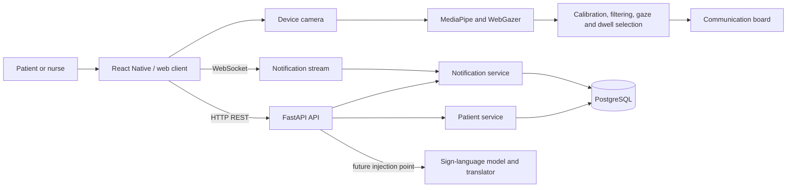

# Voice-To-Voiceless (V2VL)

Voice-To-Voiceless is an assistive communication platform for people who cannot communicate through speech. It combines an accessible communication board with gaze-based interaction, facial-expression input, and a patient-to-care-team notification channel.

The project currently supports browser and React Native development, with Android and iOS targets, a FastAPI backend, and PostgreSQL persistence.

## Contents

- [The Problem](#the-problem)
- [Our Solution](#our-solution)
- [Project Overview](#project-overview)
- [Service Schema](#service-schema)
- [Documentation](#documentation)
- [Quick Start](#quick-start)

## The Problem

People who have lost or cannot use their voice may still need to communicate basic needs, symptoms, requests, and urgent alerts. Conventional input methods can be slow, physically demanding, or unavailable when a person has limited motor control.

Care teams also need a dependable way to receive those messages, understand which patient sent them, and respond without requiring the patient to speak.

## Our Solution

V2VL provides a multimodal communication experience:

- A visual communication board for common actions and messages.
- Gaze estimation using the device camera, MediaPipe Face Landmarker, and WebGazer on the web.
- Nine-point calibration, head-movement compensation, temporal filtering, and dwell selection.
- Facial-expression recognition experiments and model-testing tools.
- Patient linking and patient context for care teams.
- Persistent notifications between patients and nurses, delivered through REST and WebSocket APIs.
- A backend extension point for live sign-language interpretation.

## Project Overview

### Description

The repository is organized as a small full-stack system:

| Area | Location | Responsibility |
| --- | --- | --- |
| Frontend | `app/frontend` | React Native application, web build, accessibility UI, camera and gaze interaction |
| Backend | `app/backend` | FastAPI application, patient and notification services, live communication endpoints |
| Database | `app/database` | PostgreSQL models, repositories, migrations, seed data, and import utilities |
| Documentation | `docs` | Setup guides and subsystem documentation |

### Technology stack

- **Client:** React 19, React Native 0.87, TypeScript, Vite, Jest
- **Computer vision:** MediaPipe Tasks Vision, WebGazer, device camera integrations
- **Server:** Python 3.11+, FastAPI, Uvicorn, Pydantic Settings
- **Persistence:** PostgreSQL 16, SQLAlchemy 2, Alembic, JSONB metadata
- **Tooling:** npm, uv, Docker Compose, pytest

## Service Schema



The frontend performs camera-based interaction locally. The backend owns patient linking, notification persistence, filtering, and real-time notification delivery. Database migrations run automatically when the backend container starts.

## Documentation

- [Frontend documentation](docs/frontend/README.md): application structure, vision pipeline, interaction model, commands, and tests.
- [Backend documentation](docs/backend/README.md): service boundaries, API routes, WebSockets, configuration, and testing.
- [Database documentation](docs/database/README.md): schema, migrations, seed data, fixtures, and local database access.
- [Local development quick start](docs/development/local-development-quickstart.md): the shortest Windows setup path.
- [Android development setup](docs/development/android-development-setup.md): native Android prerequisites and workflow.

## Quick Start

Prerequisites: Docker Desktop, Node.js 22 or newer, and npm.

```powershell
cd C:\Projects\V2VL
docker compose -f app/docker-compose.yml up --build -d
docker compose -f app/docker-compose.yml exec backend uv run --project app --no-sync python -m app.database.seed --count 10
```

In a second terminal:

```powershell
cd C:\Projects\V2VL\app\frontend
npm install
npm run start:web
```

Open the Vite URL, usually `http://localhost:5173`. The backend is available at `http://localhost:8000`, with interactive API documentation at `http://localhost:8000/docs`.

For detailed commands and platform-specific setup, start with the [local development quick start](docs/local-development-quickstart.md).