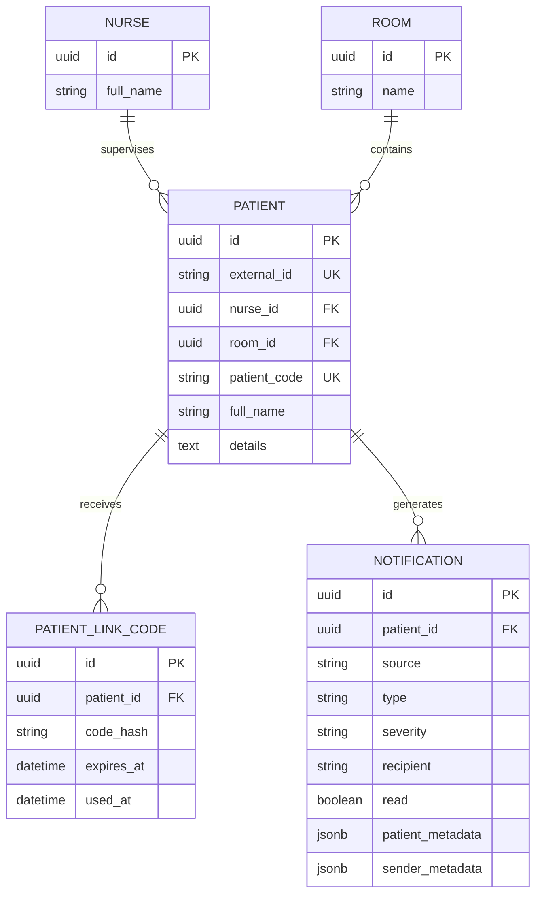

# Database Documentation

The persistence layer uses PostgreSQL 16, SQLAlchemy 2, and Alembic. Database code is kept under `app/database`; backend services use repositories and session helpers rather than embedding SQL in API handlers.

## Local database

The default Docker Compose database uses:

| Setting | Value |
| --- | --- |
| Database | `v2vl` |
| User | `postgres` |
| Password | `postgres` |
| Host port | `5434` |
| Container port | `5432` |

Start PostgreSQL and the backend from the repository root:

```powershell
docker compose -f app/docker-compose.yml up --build -d
```

The backend connects to `db:5432` inside the Compose network. Host tools such as DBeaver connect to `localhost:5434`. Do not use `down -v` unless you intend to remove the local PostgreSQL volume.

## Schema

The main relationships are:



Important constraints and behavior:

- Patient and related records use PostgreSQL UUID primary keys.
- Patient external IDs and patient codes are unique.
- Patient-to-nurse assignment is optional for imported placeholder patients.
- Room deletion clears the patient room reference; nurse deletion is restricted by the foreign key.
- Link codes are stored as SHA-256 hashes, with expiry and consumption timestamps.
- Notification metadata is stored as PostgreSQL JSONB so clients can attach structured context.
- Notification indexes support recipient/time and patient lookups.

## Migrations

Apply all migrations with:

```powershell
uv sync --project app
uv run --project app alembic -c app/database/alembic.ini upgrade head
```

The migration environment is in `app/database/alembic/`, and version files are in `app/database/alembic/versions/`. Review generated migrations before applying them to shared environments.

## Seed and import data

Create a development nurse and patients:

```powershell
uv run --project app python -m app.database.seed --count 10
```

The seeder is repeatable and only creates missing development records. One-time link codes are printed when generated.

Import the legacy notification fixture:

```powershell
uv run --project app python -m app.database.import_notifications
```

Use `--path` for a different JSON fixture. Existing notification IDs are skipped, so repeated imports do not duplicate records.

## Database tests

```powershell
uv run --project app pytest app/backend/tests/test_database_factories.py app/backend/tests/test_postgres_persistence.py
```

Persistence tests may require a running PostgreSQL instance and the expected environment configuration. For a complete local workflow, see the [Docker local development guide](../docker-local-development.md).