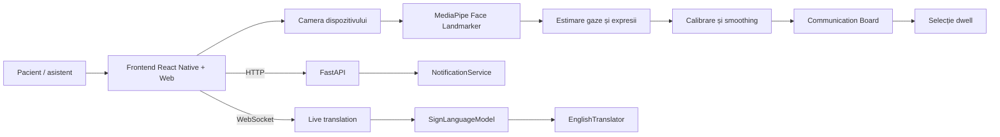

# Voice-To-Voiceless

Documentație tehnică și ghid de utilizare pentru proiectul Voice-To-Voiceless.

## 1. Scopul proiectului

Voice-To-Voiceless este un prototip de comunicare asistivă pentru persoane care nu pot comunica vocal. Interfața permite selectarea acțiunilor prin:

- atingere;
- privire, folosind camera dispozitivului și MediaPipe Face Landmarker;
- recunoașterea unor expresii faciale;
- mesaje și notificări între pacient și personalul medical;
- interpretarea unor cadre sau secvențe video pentru semne ASL, prin backend.

Aplicația frontend poate rula în browser, pe Android și pe iOS. Backend-ul Python oferă API REST pentru sănătatea aplicației și notificări, plus un WebSocket pentru traducere live.

## 2. Starea actuală

Funcționalitățile principale implementate în cod sunt:

- interfață de comunicare cu acțiuni selectabile;
- tracking facial și estimarea direcției privirii în browser;
- calibrare în nouă puncte și calibrare neliniară bazată pe regresie ridge;
- compensarea mișcării capului și filtrarea/smoothing-ul privirii;
- selecție prin dwell, cu feedback vizual și audio;
- mod de testare a recunoașterii expresiilor faciale;
- notificări pacient-asistent, stocate în memorie;
- teste Jest pentru calibrare, gaze, MediaPipe, tracking și sesiunea de model testing;
- endpoint-uri backend pentru notificări și interpretarea imaginilor.

Modelul backend pentru recunoașterea semnelor este momentan `UnconfiguredSignLanguageModel`. Pentru predicții reale trebuie injectată o implementare configurată în `ApplicationServices`.

## 3. Arhitectura sistemului



### Frontend

Punctul de intrare React Native este `App.tsx`. În browser, aplicația este montată prin `src/browser/main.tsx` și folosește `BrowserTrackingApp`.

Straturile principale sunt:

- `src/browser`: integrarea web, sesiunea camerei, tracking-ul, recunoașterea facială și layout-urile pentru tabletă/telefon;
- `src/components`: componente reutilizabile pentru cameră, layout, comunicare și tracking;
- `src/vision`: tipuri și algoritmi pentru landmark-uri, poziția feței, estimarea privirii și calibrare;
- `src/interaction`: logica de selecție prin dwell;
- `src/services`: integrarea frontend cu backend-ul, inclusiv notificări;
- `src/modelTesting`: colectarea și exportul diagnosticelor pentru calibrare;
- `src/theme`: culori, tipografie, spațiere, umbre, raze și animații;
- `src/constants` și `src/types`: constantele și contractele comune.

### Backend

Backend-ul este compus astfel:

- `app/backend/main.py`: punctul de intrare Uvicorn;
- `app/backend/api/api.py`: aplicația FastAPI, rutele REST și WebSocket;
- `app/backend/core/core.py`: composition root și injectarea serviciilor;
- `app/backend/services/notification.py`: modelul notificării și serviciul thread-safe in-memory;
- `app/backend/services/face_recognition`: detecție MediaPipe, interpretare temporală și notificări;
- `app/backend/services/eye_tracking`: serviciile backend aferente eye tracking-ului;
- `app/backend/services/language_interpreter`: contractele pentru modelul de semne și traducătorul în engleză.

## 4. Structura repository-ului

```text
app/
  backend/              API FastAPI și servicii Python
  database/             date locale/prototip
  frontend/             React Native, web și codul comun TypeScript
docs/                   documentație tehnică
tools/                  utilitare de dezvoltare
```

În frontend, directoarele native sunt:

- `android/`: proiectul Gradle și codul nativ Android;
- `ios/`: proiectul Xcode, configurarea aplicației și resursele iOS;
- `public/`: modelul MediaPipe și fișierele WASM folosite în browser;
- `dist-web/`: artefactul generat de build-ul web. Nu se editează manual.

## 5. Cerințe software

### Frontend

- Node.js `>= 22.11.0`;
- npm;
- permisiune pentru cameră în browser sau pe dispozitiv;
- pentru Android: Android Studio, JDK-ul inclus, Android SDK, ADB și un emulator/dispozitiv;
- pentru iOS: macOS, Xcode și CocoaPods. Dezvoltarea iOS nu poate fi făcută local pe Windows.

### Backend

- Python 3.10+ recomandat;
- un mediu virtual Python;
- dependențele backend instalate în mediul proiectului;
- modelul MediaPipe și/sau implementarea modelului de semne, dacă sunt necesare aceste servicii.

Repository-ul nu conține în prezent un `requirements.txt` sau `pyproject.toml`; instalarea dependențelor Python trebuie menținută împreună cu configurația mediului de dezvoltare.

## 6. Instalare și rulare

### Instalarea frontend-ului

```powershell
cd C:\Endava\EndevLocal\Voice-To-Voiceless\app\frontend
npm install
```

### Rulare în browser

Pornește serverul Vite:

```powershell
cd C:\Endava\EndevLocal\Voice-To-Voiceless\app\frontend
npm run start:web
```

Aplicația este disponibilă, de regulă, la `http://localhost:5173`.

Pentru build web:

```powershell
npm run build:web
```

Artefactele sunt scrise în `app/frontend/dist-web`.

### Rulare React Native pe Android

Pornește Metro într-un terminal:

```powershell
cd C:\Endava\EndevLocal\Voice-To-Voiceless\app\frontend
npm start
```

Într-un al doilea terminal, cu emulatorul sau dispozitivul conectat:

```powershell
npm run android
```

Variabilele Windows recomandate sunt `JAVA_HOME`, `ANDROID_HOME` și `ANDROID_SDK_ROOT`. Detaliile pentru configurarea Android se găsesc în [android-development-setup.md](android-development-setup.md).

### Rulare pe iOS

Necesită macOS:

```sh
cd app/frontend
bundle install
bundle exec pod install
npm start
```

Într-un al doilea terminal:

```sh
npm run ios
```

### Rulare backend

Din rădăcina repository-ului, cu mediul virtual activ:

```powershell
python -m uvicorn app.backend.main:app --reload --host 0.0.0.0 --port 8000
```

Backend-ul răspunde la `http://localhost:8000`. Documentația OpenAPI generată automat este disponibilă la `http://localhost:8000/docs`.

### Pornire completă pentru dezvoltare web

Pentru scenariul web cu notificări și backend active, sunt necesare două procese. Deschide două terminale PowerShell.

**Terminalul 1: backend FastAPI**

```powershell
cd C:\Endava\EndevLocal\Voice-To-Voiceless
.\.venv\Scripts\Activate.ps1
python -m uvicorn app.backend.main:app --reload --host 0.0.0.0 --port 8000
```

Verifică backend-ul înainte să pornești interfața:

```powershell
Invoke-RestMethod http://localhost:8000/health
```

Rezultatul așteptat este:

```json
{"status":"ok"}
```

**Terminalul 2: frontend Vite**

```powershell
cd C:\Endava\EndevLocal\Voice-To-Voiceless\app\frontend
npm run start:web
```

Deschide `http://localhost:5173`. În acest mod:

- Vite servește aplicația web și codul React;
- browserul accesează camera și rulează MediaPipe/WASM local;
- frontend-ul apelează backend-ul la `http://localhost:8000` pentru notificări;
- endpoint-ul de traducere live este disponibil la `ws://localhost:8000/api/v1/translation/live`.

### Pornire completă pentru Android

Android folosește trei elemente: emulatorul sau dispozitivul, Metro și aplicația instalată.

1. Pornește un emulator din Android Studio sau conectează un dispozitiv cu USB debugging activ.
2. Verifică dispozitivul:

```powershell
adb devices
```

3. În Terminalul 1 pornește Metro:

```powershell
cd C:\Endava\EndevLocal\Voice-To-Voiceless\app\frontend
npm start
```

4. În Terminalul 2 construiește și instalează aplicația:

```powershell
cd C:\Endava\EndevLocal\Voice-To-Voiceless\app\frontend
npm run android
```

Backend-ul trebuie pornit separat dacă funcționalitățile Android folosesc API-ul local. Pentru un emulator Android, `localhost` din aplicație poate indica emulatorul, nu calculatorul; configurează host-ul backend-ului ca `10.0.2.2` pentru emulatorul standard sau ca adresa IP locală a calculatorului pentru un dispozitiv fizic.

### Pornire completă pentru iOS

iOS necesită macOS, Xcode și CocoaPods. Pornește simulatorul sau conectează dispozitivul, apoi:

```sh
cd app/frontend
bundle install
bundle exec pod install
npm start
```

Într-un al doilea terminal:

```sh
cd app/frontend
npm run ios
```

Dacă aplicația iOS trebuie să apeleze backend-ul de pe calculator, folosește hostname-ul sau IP-ul accesibil din simulator/dispozitiv, nu presupune automat că `localhost` indică mașina de dezvoltare.

### Ce se pornește și ce nu se pornește separat

Componentele următoare sunt biblioteci sau module interne și pornesc automat în procesul frontend-ului:

- React și componentele UI;
- camera browserului sau `react-native-vision-camera`;
- MediaPipe Face Landmarker;
- WASM-ul MediaPipe din `public/wasm`;
- estimarea privirii, calibrarea, smoothing-ul și selecția dwell;
- serviciul frontend de notificări;
- modulele `components`, `vision`, `interaction` și `modelTesting`.

Nu există procese independente pentru aceste module. Singurele procese de dezvoltare care trebuie pornite explicit sunt:

| Componentă | Comandă | Port / rezultat |
| --- | --- | --- |
| Backend FastAPI | `python -m uvicorn app.backend.main:app --reload --port 8000` | `8000` |
| Frontend web | `npm run start:web` | `5173` |
| Metro React Native | `npm start` | `8081` implicit |
| Aplicație Android | `npm run android` | APK instalat în emulator/dispozitiv |
| Aplicație iOS | `npm run ios` | aplicație în simulator/dispozitiv |

Nu porni simultan Vite și Metro pentru același flux de aplicație decât dacă testezi intenționat web și nativ în paralel.

### Oprirea componentelor

- Vite, Metro și Uvicorn se opresc cu `Ctrl+C` în terminalul lor;
- aplicația Android/iOS se poate închide din emulator, dispozitiv sau IDE;
- oprirea backend-ului șterge notificările deoarece `NotificationService` este in-memory;
- procesele native Gradle/Xcode lansate de build se închid după finalizarea instalării.

## 7. Utilizarea aplicației

### Tracking prin privire

1. Pornește aplicația web și acordă permisiunea pentru cameră.
2. Apasă `Start eye tracking`.
3. Urmează ținta de calibrare; sunt folosite nouă poziții.
4. După o calibrare validă, mută privirea pe o acțiune din communication board.
5. Menține privirea asupra acțiunii până la completarea progresului dwell.
6. Acțiunea este selectată și este afișat feedback vizual/audio.

Atingerea rămâne disponibilă ca mecanism alternativ de selecție.

### Recunoașterea feței

Butonul `Test face recognition` pornește sesiunea de recunoaștere facială. Panoul afișează starea feței, riscul calculat, expresia și indicatorii detectați. Tracking-ul privirii și recunoașterea facială sunt moduri exclusive în interfața curentă.

### Notificări

Frontend-ul verifică periodic notificările destinate pacientului, la interval de trei secunde. Notificările sunt filtrate după `patient_id`, iar cele citite pot fi marcate prin endpoint-ul dedicat.

## 8. Pipeline-ul de gaze și calibrare

Pipeline-ul frontend este:

1. camera furnizează cadre video;
2. `MediaPipeFaceLandmarkerAdapter` creează și rulează landmarker-ul;
3. `mediaPipeLandmarkMapper` convertește rezultatele MediaPipe în tipuri interne;
4. `gazeEstimator` estimează coordonate normalizate pentru privire;
5. `facePoseEstimator` estimează yaw, pitch, roll și dimensiunea relativă a feței;
6. `gazeSmoother` reduce variațiile dintre cadre;
7. `GazeCalibrationMapper` transformă coordonatele brute în coordonate calibrate;
8. `gazeTargetResolver` găsește acțiunea de sub cursor;
9. `dwellSelector` confirmă selecția după o perioadă stabilă.

Calibrarea poate fi respinsă când există prea puține grupuri de ținte, instabilitate ridicată, matrice singulară, reziduuri prea mari sau o plajă insuficientă a privirii. Pentru depanare se poate activa `enableDiagnostics`; aplicația descarcă un fișier `gaze-calibration-diagnostics-*.json`.

## 9. API backend

### Health check

```http
GET /health
```

Răspuns:

```json
{"status":"ok"}
```

### Creare notificare

```http
POST /api/v1/notifications
Content-Type: application/json
```

```json
{
  "source": "face_recognition",
  "type": "risk_detected",
  "severity": "warning",
  "message": "Este necesară atenția asistentului.",
  "patient_metadata": {"patient_id": "patient-001"},
  "recipient": "nurse",
  "sender_metadata": {}
}
```

### Alertă asistent către pacient

```http
POST /api/v1/nurse/alerts
Content-Type: application/json
```

```json
{
  "message": "Asistentul va veni în curând.",
  "severity": "info",
  "patient_metadata": {"patient_id": "patient-001"},
  "nurse_metadata": {"nurse_id": "nurse-001"}
}
```

### Listare notificări

```http
GET /api/v1/notifications?include_read=false&recipient=patient
```

Parametri:

- `include_read`: include sau exclude notificările citite;
- `recipient`: filtrează după destinatar, de exemplu `patient` sau `nurse`.

### Marcare ca citită

```http
POST /api/v1/notifications/{notification_id}/read
```

Returnează `404` dacă id-ul nu există.

### Interpretarea unui cadru

```http
POST /api/v1/sign-language/interpret
Content-Type: multipart/form-data
```

Formularul trebuie să conțină câmpul `image`. Răspunsul conține predicția modelului și traducerea în engleză. Un fișier gol produce `400`.

### Traducere live prin WebSocket

```text
ws://localhost:8000/api/v1/translation/live
```

Clientul trimite cadre binare. Serverul:

- răspunde cu `buffering` până primește `sequence_length` cadre;
- produce `candidate` pentru primele predicții;
- răspunde cu `uncertain` când votul sau încrederea nu depășesc pragurile;
- trimite o traducere stabilă după cel puțin două potriviri din ultimele trei predicții și o încredere medie de minimum `0.70`;
- ignoră label-ul `unknown` ca traducere confirmată.

Lungimea implicită a secvenței este `64`, iar stride-ul ferestrei este aproximativ un sfert din secvență.

## 10. Configurarea serviciilor backend

`create_services()` din `app/backend/core/core.py` construiește serviciile implicite:

- `UnconfiguredSignLanguageModel`: model placeholder;
- `GlossaryEnglishTranslator`: traducător bazat pe glosar;
- `NotificationService`: stocare in-memory;
- `sequence_length=64`.

Pentru teste sau integrarea unui model real, se poate apela `create_app(services=...)` cu o instanță `ApplicationServices` construită de test sau de procesul de startup.

`NotificationService` nu persistă datele pe disc și nu oferă sincronizare între procese. Repornirea backend-ului golește notificările.

## 11. Testare și verificări de calitate

Din `app/frontend`:

```powershell
npm test
npm run typecheck
npm run lint
```

Testele acoperă, între altele:

- MediaPipe și maparea landmark-urilor;
- estimarea și smoothing-ul privirii;
- calibrarea liniară și neliniară;
- compensarea poziției feței;
- calitatea calibrării și diagnosticarea pose envelope;
- selecția joystick/dwell;
- pierderea tracking-ului;
- sesiunea de model testing;
- randarea aplicației și debug overlay.

Înainte de un build web:

```powershell
npm run typecheck
npm test -- --runInBand
npm run build:web
```

## 12. Depanare

### Camera nu pornește

- verifică permisiunea de cameră în browser sau în sistemul de operare;
- folosește HTTPS sau `localhost`, deoarece accesul la cameră poate fi blocat pe origini nesigure;
- verifică să nu fie activ simultan un alt mod de cameră;
- pe Android, confirmă că dispozitivul apare în `adb devices`.

### Backend-ul nu este accesibil

- verifică `GET http://localhost:8000/health`;
- pornește Uvicorn pe portul `8000`;
- verifică firewall-ul și faptul că frontend-ul folosește același hostname;
- pentru browser, verifică originile CORS configurate în `api.py`.

### Portul Metro 8081 este ocupat

Păstrează serverul Metro existent sau oprește procesul vechi. Alternativ, pornește Metro pe alt port și transmite același port comenzii Android. Procedura detaliată este în [android-development-setup.md](android-development-setup.md).

### Calibrarea eșuează

- poziționează fața frontal, suficient de vizibilă și iluminată;
- urmărește fiecare țintă fără mișcări bruște;
- repetă calibrarea;
- activează diagnosticarea și inspectează JSON-ul descărcat pentru yaw, pitch, eye scale și inter-eye distance.

### Notificările nu apar

- backend-ul trebuie să ruleze pe portul `8000`;
- verifică `patient_id`, deoarece aplicația tabletă caută `patient-001`;
- verifică dacă notificarea este necitită și are `recipient: "patient"`;
- serviciul este in-memory, deci datele dispar la restart.

## 13. Convenții de dezvoltare

- Rulează comenzile frontend din `app/frontend`.
- Păstrează algoritmii de viziune în `src/vision`, nu în componentele UI.
- Folosește tipurile din `src/types` și `src/browser/browserTypes.ts` pentru contracte comune.
- Folosește dependency injection în backend pentru modele și servicii testabile.
- Nu edita manual `dist-web`; regenerează-l prin `npm run build:web`.
- Adaugă sau actualizează teste Jest pentru orice modificare a algoritmilor de calibrare, tracking sau selecție.
- Nu introduce secrete, token-uri sau date medicale reale în repository.

## 14. Limitări și pași tehnici următori

- backend-ul nu persistă notificările într-o bază de date;
- modelul real de semne nu este configurat implicit;
- nu există încă un manifest Python standard pentru instalarea reproductibilă a backend-ului;
- CORS este configurat pentru dezvoltare locală, nu pentru producție;
- endpoint-urile nu au autentificare sau autorizare;
- procesarea live trebuie optimizată și monitorizată pentru latență pe dispozitive reale;
- trebuie definite politici de retenție, anonimizare și protecție pentru date video și metadata pacienților înainte de utilizare clinică.

## 15. Referințe rapide

- Frontend entry point: `app/frontend/App.tsx`
- Browser entry point: `app/frontend/src/browser/main.tsx`
- Browser application: `app/frontend/src/browser/BrowserTrackingApp.tsx`
- Vision pipeline: `app/frontend/src/vision`
- Frontend notifications: `app/frontend/src/services/notifications.ts`
- Backend entry point: `app/backend/main.py`
- Backend API: `app/backend/api/api.py`
- Backend composition root: `app/backend/core/core.py`
- Android setup: [android-development-setup.md](android-development-setup.md)